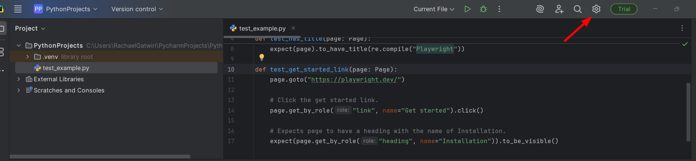
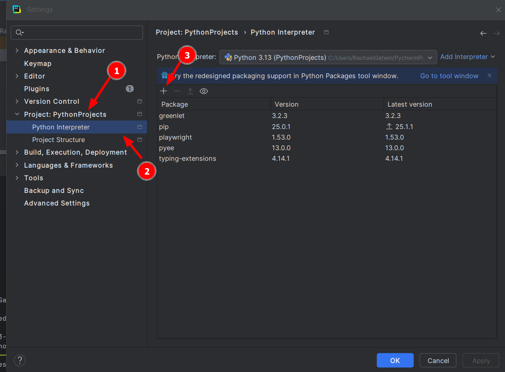

# 🎭 Playwright with Pytest

Welcome! This repository documents my learning journey with Playwright using Python and Pytest. It includes examples, experiments, and notes as I explore browser automation and testing.

---

## 📚 Resources I'm Following

- [Playwright Python Documentation](https://playwright.dev/python/)
- [YouTube Playlist – Playwright with Python (Code with Harry)](https://www.youtube.com/playlist?list=PLP5_A7hnY1Tggph0F0cRqf5iyyZuIBXYC)

---

## 🛠️ Tech Stack

- **Language:** Python 3.x
- **Test Framework:** Pytest
- **Automation Library:** Playwright
- **Others:** `pytest-playwright`

---

## 🚀 Getting Started

### 0. Download/Install Pycharm:[Pycharm Download](https://www.jetbrains.com/help/pycharm/installation-guide.html#standalone)

### 1. Clone the Repository

```bash
git clone https://github.com/rachael-muga0/Playwright-Pytest.git
cd playwright-pytest
````

### 2. Create a Virtual Environment (Optional but Recommended)
```bash
python -m venv venv
source venv/bin/activate   # On Windows: venv\Scripts\activate
 ````

### 3. Install Dependencies
```bash
pip install -r requirements.txt
````
If you don’t have requirements.txt yet, create it with:
* pytest
* playwright
* pytest-playwright
* pytest-html (Optional: for generating test reports)
Then run:
```bash
pip install -r requirements.txt
````
### Install Playwright
````bash
pip install pytest-playwright
````
Then:
* Go to settings
* Go to Projects > Python Interpreter > add playwright > Install package

### 4. Install Browsers
```bash
playwright install