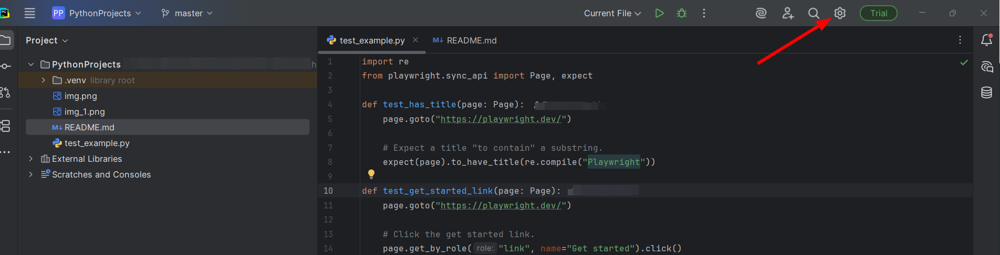
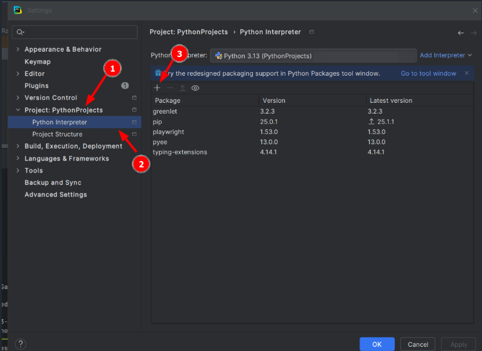

# 🎭 Playwright with Pytest

Hello! This repository documents my learning journey with Playwright using Python and Pytest. It includes examples, experiments, and notes as I explore browser automation and testing.

---

## 📚 Resources I'm Following

- [Playwright Python Documentation](https://playwright.dev/python/)
- [YouTube Playlist – Playwright with Python (Code with Harry)](https://www.youtube.com/playlist?list=PLP5_A7hnY1Tggph0F0cRqf5iyyZuIBXYC)

---

## 🛠️ Tech Stack

- **Language:** Python 3.9.13
- **Test Framework:** Pytest
- **Automation Library:** Playwright
- **Others:** `pytest-playwright`, `pytest-html` (for optional reports)

---

## 🚀 Getting Started

### 0. Download/Install Pycharm: [Pycharm Download](https://www.jetbrains.com/help/pycharm/installation-guide.html#standalone)

### 1. Clone the Repository

```bash
git clone https://github.com/rachael-muga0/Playwright-Pytest.git
cd playwright-pytest
```

### 2. Create a Virtual Environment (Optional but Recommended)
```bash
python -m venv venv
source venv/bin/activate   # On Windows: venv\Scripts\activate
 ```

### 3. Install Python Extension (VS Code / VSCodium only)
* Open VS Code / VSCodium
* Go to Extensions (Ctrl+Shift+X)
* Search for Python (by Microsoft) and install it

### 4. Install Dependencies
```bash
pip install --upgrade pip
pip install pytest
pip install playwright
pip install pytest-playwright
pip install pytest-html  # optional
```
### 4. Install Playwright Browsers
```bash
playwright install
```
On Linux, ensure all required system libraries are installed (see Playwright docs).
If using PyCharm,
* Go to settings!
* Go to Projects > Python Interpreter > add playwright > Install package!

#### 🧪 Running Tests
```` bash
pytest
````
#### Run with HTML Report
```` bash
pytest --html=report.html
````
#### Run a Specific Test File
```` bash
pytest tests/test_example.py
````
#### 🌐 Running Tests on Different Browsers
```` bash
playwright codegen <url you are testing(e.g: https://google.com)>
````
#### Running Playwright Traceviewer
```` bash
pytest --tracing on
````
#### 🌐 Viewing Playwright Traceviewer
```` bash
playwright show-trace <path to the zip file>
````

###### 🤝 Contributions
This is primarily for my own learning, but feel free to fork or suggest improvements via PR or Issues.
###### 📄 License
This project is for educational purposes and is currently not licensed for production use.